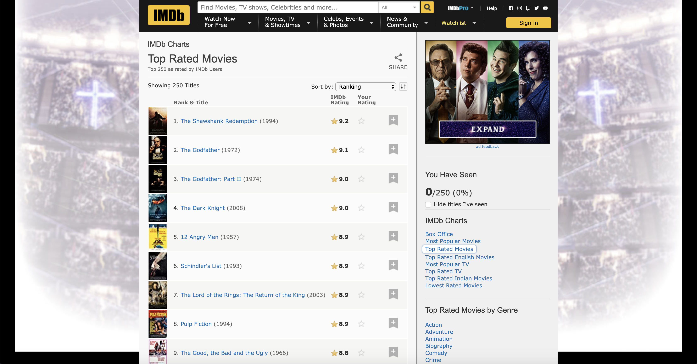
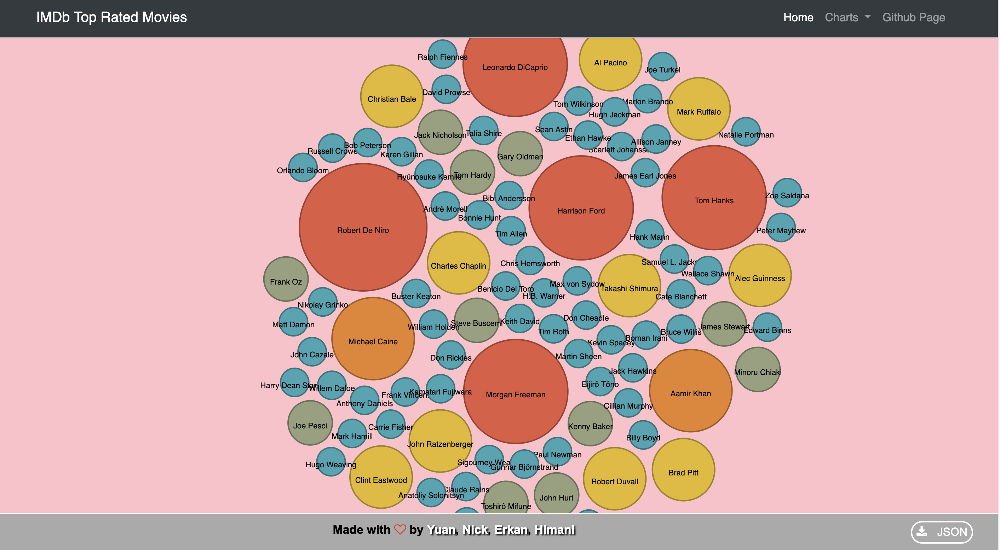
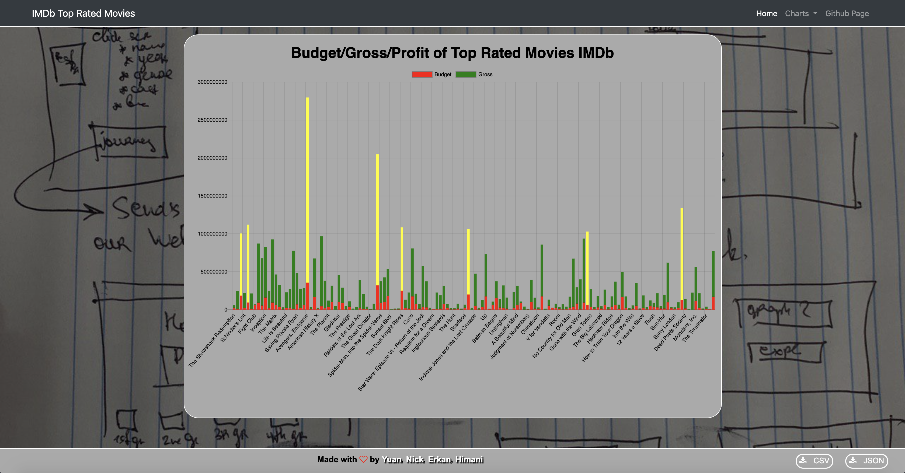
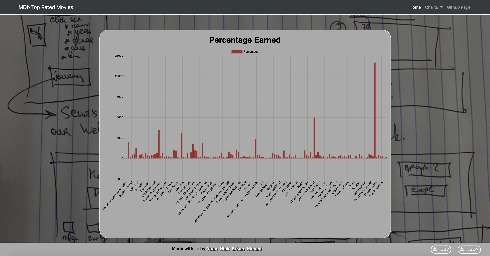
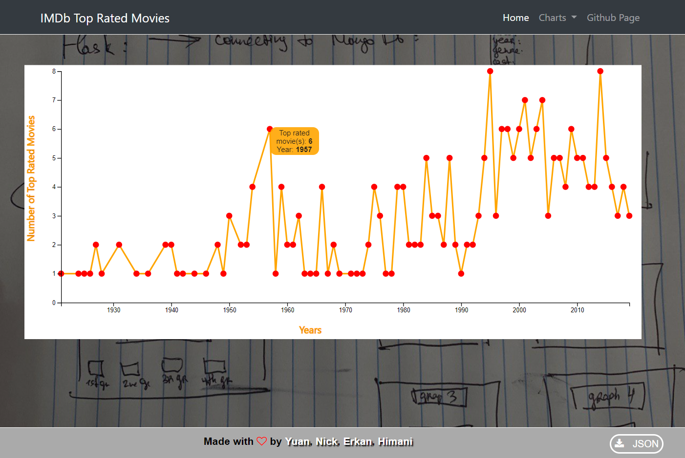
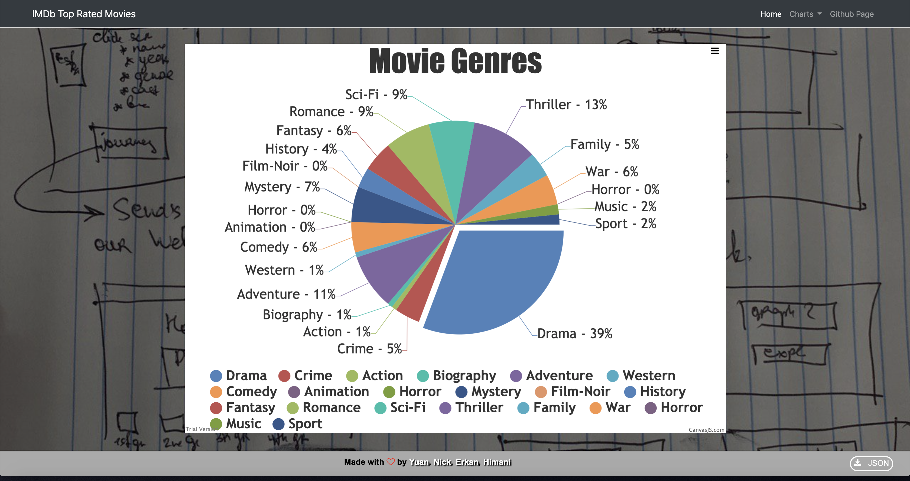

# IMDB_top_rated_movies

In this project we wanted to show main factors for making the top rated movies.
If you have an idea for the movie and couple of dollars to invest then our project will tell you the major steps that you should take in order to get into the top 250 rated movies.
We got the information from the IMDB.com web site.

We used Python Flask for scraping the web site.

All information was stored as the JSON file.

We agreed in making index web page and 4 charts with different chart types.
All charts are done with JavaScript using D3.js and Chart.js.
Chart.js is the new library that was not used before and Bubble chart is the type of the chart that was also not used in the class.

The index chart contains the explanation of the project with drop down menus and chart buttons at the bottom. Clicking on the buttons at the bottom or dropdown menus will take you to the new chart that will show you that chart.

The bubble chart is representing the actors that played the role in the movies and bigger bubble presents that he played in multiple movies.

The bar chart shows the budget, profit and percent profit for each movie.

The line chart shows the number of the movies made in each year which will show that creativity bloomed in the some years comparing to others.

The Pie chart shows the favorite genre of the movies.

At the end of the presentation you will find that choosing some actors, budget and genre will give you some advantage in making the very profitable movie.
